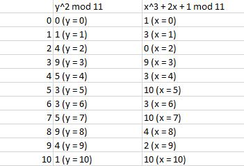
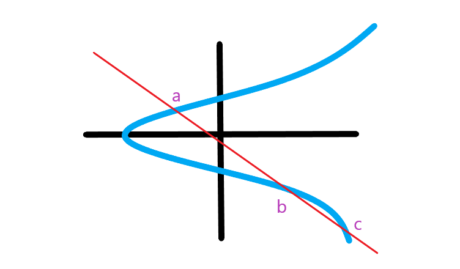

# Types of Elliptical Curves

- Elliptical Curve is over a finite field
- Finite Field Examples
- GF(2), GF(5), GF(8) ...

- y^2 = x^3 + ax + b mop p
- Where a and b are no greater than p and,
- 4a^3 + 27b^2 mod p != 0

---

- points found (x, y):
- (0, 1), (0, 10), (1, 5), (1, 6), (2, 0), (3, 3), (3, 8), (4, 5), (4, 2), (6, 5), (6, 6), (8, 2), (8, 9)

---

**Check if a point falls on the curve**

